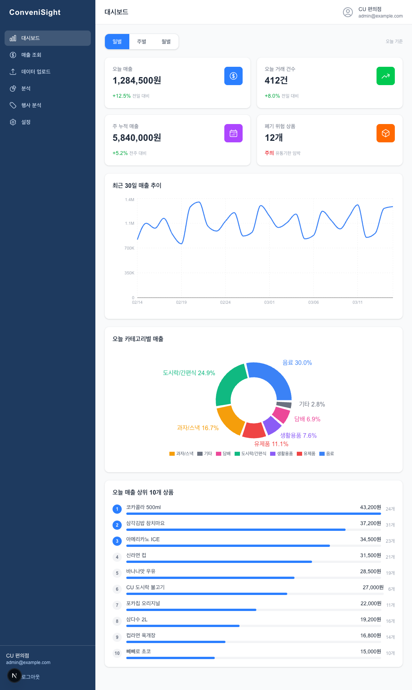
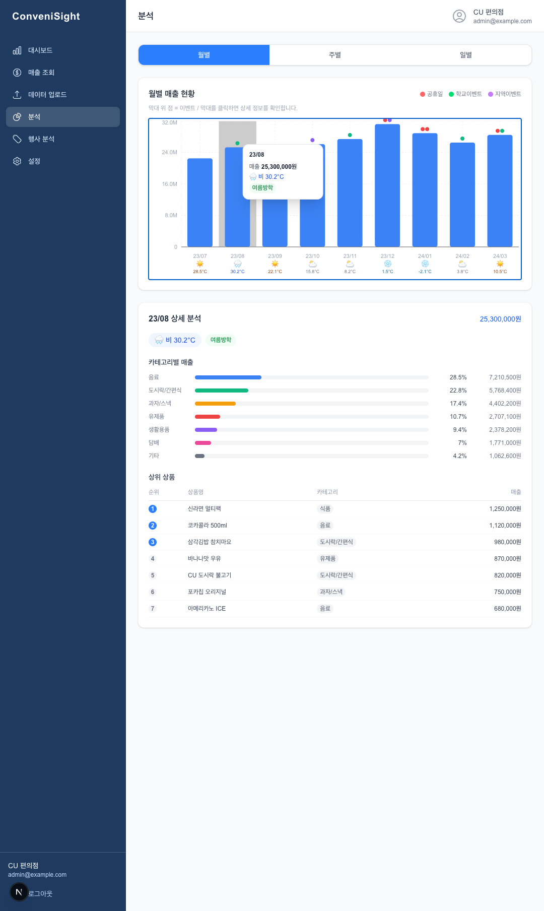
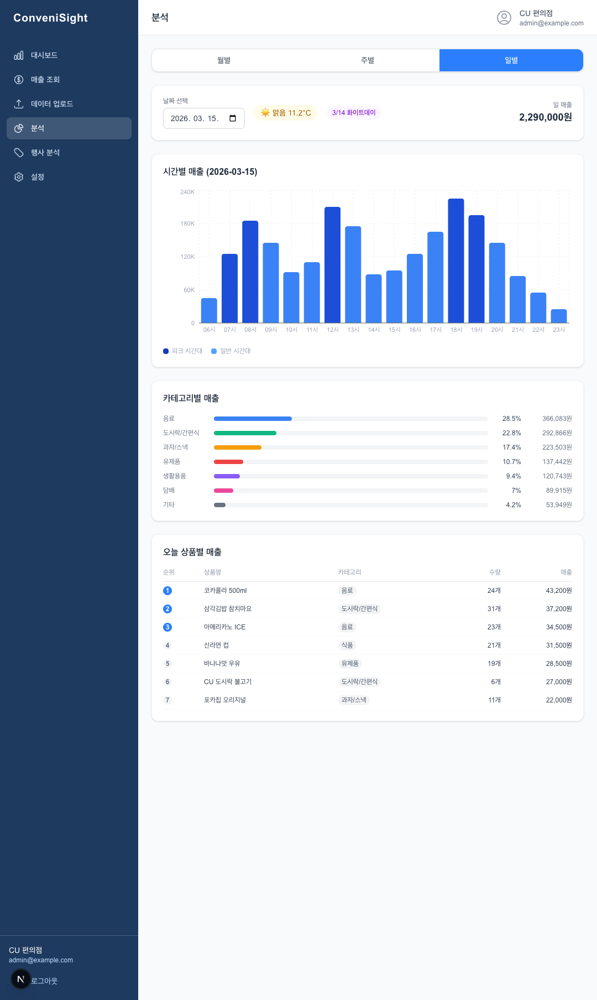
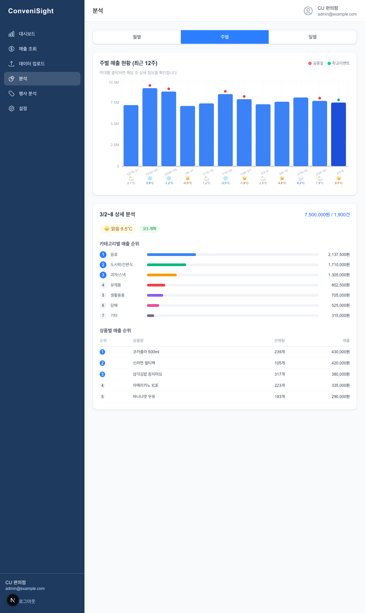

# ConveniSight

편의점 점주를 위한 매출 분석 웹앱입니다. 가족 중에 CU 편의점을 운영하는 분이 있어서, 실제로 써볼 수 있는 걸 만들어보자고 시작했습니다.

POS 데이터를 Excel/CSV로 올리거나 스크린샷을 찍어 올리면 일별·월별·시간대별로 분석해주고, 기상청 날씨나 공휴일과 매출을 겹쳐서 볼 수 있습니다. 행사 참여 여부에 따른 손익 비교와 폐기 위험 상품 알림도 있습니다.

---

## 화면

| 대시보드 | 분석 - 월별 |
|----------|-------------|
|  |  |

| 분석 - 일별 (날씨 연동) | 분석 - 주별 |
|-------------------------|-------------|
|  |  |

---

## 기능

- **매출 대시보드** — 오늘/전일/이번달 KPI 요약, 일별·주별·월별 추이 차트, 카테고리 비율
- **데이터 업로드** — Excel/CSV (POS마다 다른 한글 컬럼명 자동 매핑) + 스크린샷 OCR
- **매출 분석** — 날씨·이벤트 오버레이 포함 월별·주별·일별·시간대별 분석
- **수요 예측 & 폐기 위험** — 7일/30일 이동 평균 기반 예측, 급락 상품 자동 알림
- **행사 이익율 계산기** — 참여/미참여 시나리오 비교, 손익분기점 계산

---

## 기술 스택

**Frontend**


**Backend**


**Infra**


---

## 구조

```
Frontend (Next.js :3000)
        │
Backend (FastAPI :8000)
  ├── /api/auth      → JWT 인증
  ├── /api/sales     → 매출 CRUD
  ├── /api/upload    → CSV/Excel + OCR
  ├── /api/analysis  → 일별/월별/시간대별/예측/폐기위험
  ├── /api/events    → 이벤트 + 공휴일 동기화
  ├── /api/weather   → 기상청 ASOS 연동
  └── /api/promotion → 행사 이익율 계산
        │
  ┌─────┴─────┐
PostgreSQL   Redis (분석 캐시 5분 TTL)
```

---

## 몇 가지 선택

**OCR은 2단계로**
POS 스크린샷을 바로 DB에 밀어넣으면 인식 오류가 섞여도 걸러낼 방법이 없습니다. OpenCV로 전처리(그레이스케일 → 적응형 이진화 → 노이즈 제거) → Tesseract 인식 → 사용자가 결과 확인·수정 → 저장 확정, 이렇게 두 단계로 나눴습니다.

**수요 예측은 단순하게**
편의점 한 곳의 데이터에 복잡한 ML 모델을 쓰는 건 맞지 않습니다. 7일·30일 이동 평균을 비교해서 최근 7일이 크게 떨어진 상품을 폐기 위험으로 잡는 방식이 오히려 설명하기도 쉽고 실용적이었습니다.

**한글 컬럼 자동 매핑**
POS 시스템마다 Excel 컬럼명이 다 달라서, 미리 정의한 매핑 테이블로 다양한 형식을 자동으로 인식하게 했습니다.

---

## E2E 테스트

Playwright로 63개 테스트를 작성했습니다. 7개 페이지 전부 커버되고 전체 통과합니다.

신경 쓴 부분이 두 가지입니다.

첫째, 55개 인증 필요 테스트가 매번 로그인하면 느리니까 `globalSetup`에서 한 번만 인증하고 `storageState`를 파일로 저장해서 각 테스트에 주입했습니다.

둘째, `waitForResponse`를 `goto()` 이후에 등록하면 응답을 놓치는 race condition이 생깁니다.

```typescript
// ❌ goto 후 등록 — 이미 응답이 끝났을 수 있음
await authedPage.goto("/sales");
await authedPage.waitForResponse("**/api/sales*");

// ✅ 먼저 등록, 그 다음 이동
const res = authedPage.waitForResponse(
  r => r.url().includes("/api/sales") && r.status() === 200
);
await authedPage.goto("/sales");
await res;
```

UI 셀렉터는 Page Object Model로 분리해서 UI가 바뀌어도 테스트 로직을 건드리지 않게 했습니다. 공유 DB 오염 방지를 위해 `workers: 1`로 직렬 실행하고, Next.js JIT 지연에 대응해 `retries: 1`을 줬습니다.

```bash
cd frontend
npx playwright test              # 전체 실행
npx playwright test --ui         # 대화형 모드
npx playwright show-report       # HTML 리포트
```

---

## 빠른 시작

```bash
# DB 올리기
docker-compose up -d postgres redis

# 백엔드
cd backend
pip install -r requirements.txt
alembic upgrade head
uvicorn app.main:app --reload --port 8000

# 프론트엔드 (새 터미널)
cd frontend && npm install && npm run dev
```

데모 계정: `demo@conveni.com` / `demo1234`

API 문서: `http://localhost:8000/docs`

```bash
# Docker로 한 번에 실행
docker-compose up -d
```

---

## CI/CD

main·feat/** 브랜치 push/PR 시 Frontend(lint → build), Backend(py_compile) 자동 검사합니다.

---

This project is for portfolio purposes.
